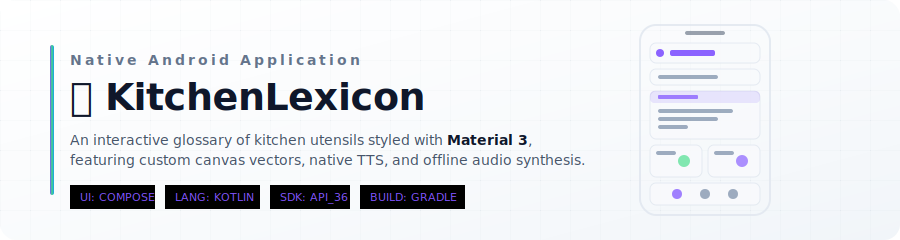

# 🍳 KitchenLexicon

<p align="center">
  
</p>

> [!IMPORTANT]
> **Engineered with Antigravity 2.0**
> This native Android app was developed, structured, and compiled with the assistance of the **Google Antigravity 2.0 AI Engineering Suite**, leveraging modern architecture design, reactive state management, and strict compilation validation.

---

## ⚡ Technical & Operating Dashboard

<table align="center" width="100%">
  <thead>
    <tr>
      <th align="center" width="50%">📱 Native Android Stack</th>
      <th align="center" width="50%">🐧 Development Environment</th>
    </tr>
  </thead>
  <tbody>
    <tr>
      <td align="center" valign="top">
        <a href="https://kotlinlang.org" target="_blank">
          <br/>
          <sub><b>Kotlin Multiplatform</b></sub>
        </a>
        <br/><br/>
        <a href="https://developer.android.com" target="_blank">
          <br/>
          <sub><b>Native Android SDK</b></sub>
        </a>
        <br/><br/>
        <a href="https://gradle.org" target="_blank">
          <br/>
          <sub><b>Gradle (Kotlin DSL)</b></sub>
        </a>
      </td>
      <td align="center" valign="top">
        <a href="https://cachyos.org" target="_blank">
          <br/>
          <sub><b>CachyOS Linux</b></sub>
        </a>
        <br/><br/>
        <a href="https://archlinux.org" target="_blank">
          <br/>
          <sub><b>Arch Engine</b></sub>
        </a>
        <br/><br/>
        <a href="https://kde.org" target="_blank">
          <br/>
          <sub><b>KDE Plasma 6.7</b></sub>
        </a>
      </td>
    </tr>
  </tbody>
</table>

---

## ✨ Core Features

*   🎨 **Material 3 Design System**: Fully native, highly responsive UI styled with Jetpack Compose featuring Slate Dark and Warm Cream Light themes.
*   🗣️ **Native Speech Engine**: Deep integration with the Android native `android.speech.tts.TextToSpeech` API for voice annotations.
*   🎵 **Offline Audio Synthesis**: Dynamic sound effects generated at runtime utilizing the low-latency `ToneGenerator` audio API.
*   🖋️ **Programmatic Vector Assets**: Scalable vector icons drawn via Jetpack Compose Canvas draw paths, avoiding traditional heavy bitmap payloads.
*   🧠 **State-Driven Interactive Quiz**: Reactive game center with streak counting, performance score feedback, and state restoration loops.

---

## 🛠️ Architecture & Specifications

| Dimension | Specification Details |
|---|---|
| **Language** | Kotlin (100% Declarative Compose syntax) |
| **Framework** | Jetpack Compose for UI, StateFlow for state management |
| **Design Style** | Material Design 3 (Dynamic Color adaptation) |
| **Build Configuration** | Gradle Kotlin DSL (`build.gradle.kts`) |
| **Target SDK** | Android 16 (API Level 36) |
| **Min SDK** | Android 8.0 Oreo (API Level 26) |

---

## 📦 Compilation & Build Guide

To build the project locally on an Arch-based Linux environment (such as CachyOS):

### 1. Set Up Java Development Kit (JDK)
Ensure OpenJDK 17 or higher is installed and active in your system path:
```bash
sudo pacman -S jdk-openjdk
```

### 2. Configure Android Home Variables
Map the path variables pointing to your local Android SDK location:
```bash
export ANDROID_HOME=$HOME/Android/Sdk
export PATH=$PATH:$ANDROID_HOME/tools:$ANDROID_HOME/platform-tools
```

### 3. Run the Gradle Assembler
Using the Gradle wrapper (`gradlew`), execute the clean compilation sequence:
```bash
./gradlew clean assembleDebug
```
The output APK file will be packaged in:
`app/build/outputs/apk/debug/app-debug.apk`

---

<p align="center">
  <sub>Generated with precision. Engineered with <b>Google Antigravity 2.0</b>.</sub>
</p>
